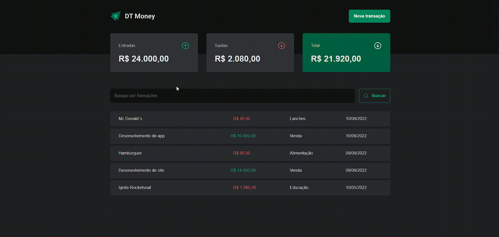

<h1 align="center">
 
    
 
</h1>

Foi construído uma aplicação front-end web completa, conectando com a API ( criada usando JSON Server ) e aprendizados/aprofudamentos em Context API e principalmente na perfomance de aplicações com o React.

  

    

 

## Tecnologias

O projeto foi desenvolvido com as seguintes Tecnologias:

- React
- Typescript
- Context API
- JSON Server
- Axios
- Styled Components
- React Hook Form
- ZOD
- Context Selectors
- Perfomance React ( useMemo, memo, useCallback)

---

Feito por Matheus Bezerra, entre em contato pelo Linkedin --> <a href="https://www.linkedin.com/in/matheus-bezerra04/">Matheus-Bezerra04</a>

Ou entre em contato pelo Numero (11) 97661-1929

